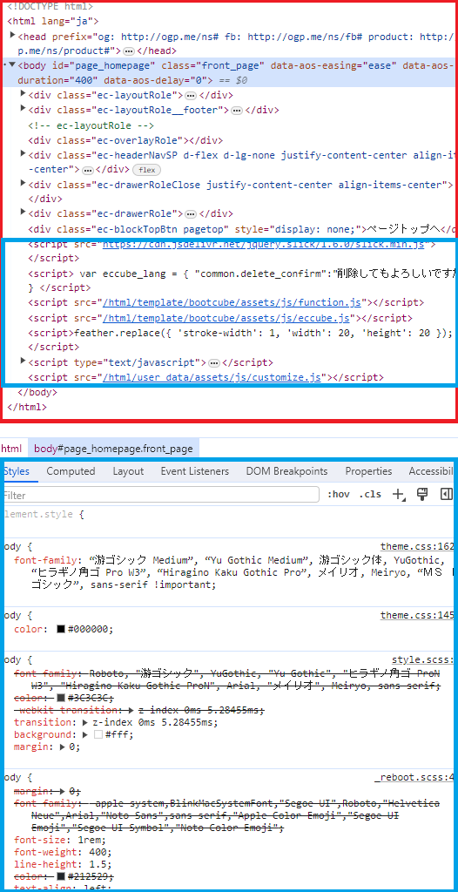

# ブラウザと front3 言語

## ここで学ぶこと

1. ブラウザってなに？
2. ブラウザを表示させるために必要な３言語とは？

## 1. ブラウザってなに？

### 1-1. ブラウザの中身を見てみよう

1. 同ディレクトリにある `index.html` を右クリック
2. path をコピーして、任意のブラウザに張り付けて読み込み  →Hello world が表示される
3. `F12`を押下(ディベロッパーツールを開く) → 先ほどのコードが表示される

> [!IMPORTANT]POINT
> ブラウザは、提供された HTML ファイル(設計書)を表示する機能

## 2.ブラウザを表示させるために必要な３言語

### 2-1.設計書の種類

任意のサイトを dev tool で開くと、下図のようにいっぱい色々表示される

- HTML (赤枠)
  - ブラウザに文字や画像を表示させる
- CSS (下の青枠)
  - 色や形などの静的変化をつける
- JavaScript(上の青枠)
  - HTML や CSS に動きをつける
  - ex) ボタンをおしたら、〇〇が表示される

> [!IMPORTANT]POINT
> ブラウザは、HTML/CSS/JS の３つの言語で成り立つ  
> この３つの言語を扱ってユーザーに画面を見せる部分を**フロントエンド**という

> [!NOTE]まとめ
>
> - **ブラウザというのは、文字で渡された設計書を画面で表示するもの！**
> - 設計書の種類は３つ
>   - 文字や画像の「表示」を司る HTML
>   - 文字や画像の「編集」を司る CSS
>   - 文字や画像の「動き・変化」を司る JS
